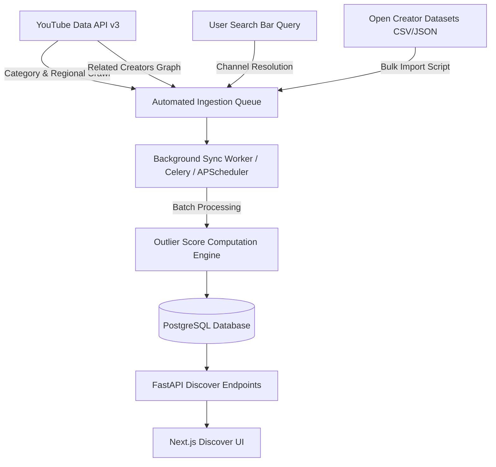

# Feature Specification & Architecture: Scaling the Creator Database (Eden-Style)

## Overview
This document outlines the architectural strategy and technical implementation plan to build, scale, and automatically maintain a massive global database of YouTube creators and outlier videos—matching and exceeding the coverage of platforms like Eden ([app.eden.so](https://app.eden.so/)).

Rather than relying solely on manual creator additions, this system combines **automated category crawling**, **graph expansion**, **on-demand user ingestion**, and **bulk dataset seeding**.

---

## Architecture Overview



---

## 1. The 4 Expansion Strategies

### Strategy 1: Automated Category & Regional Trending Crawler
Target file: `discover_api/youtube/crawler/category_crawler.py`

* **Goal**: Systematically discover top & rising creators across every content niche worldwide.
* **Mechanism**:
  1. Query `videoCategories.list` to get all official category IDs (e.g. `27` = Education, `28` = Science & Tech, `24` = Entertainment, `20` = Gaming, `17` = Sports).
  2. Query `videos.list(chart="mostPopular", videoCategoryId=cat_id, regionCode=region)` across 10 key regions (`US`, `GB`, `CA`, `AU`, `IN`, `DE`, `FR`, `BR`, `JP`, `KR`).
  3. Extract `channelId` from every returned video.
  4. Batch query `channels.list(id="id1,id2,id3...")` (up to 50 per request) to retrieve subscriber counts, avatars, and custom handles.
  5. Upsert new channels into PostgreSQL and queue video collection.

---

### Strategy 2: On-Demand "Search & Auto-Ingest" Engine
Target file: `discover_api/youtube/search_ingest.py`

* **Goal**: Turn user search queries into an automatic database multiplier.
* **Mechanism**:
  1. When a user searches for a handle (e.g. `@mkbhd`) or topic on the Discover app, query PostgreSQL first.
  2. If the channel or topic is missing, call YouTube API `search.list(q=query, type="channel")` live.
  3. Return immediate results to the user while asynchronously enqueuing a background task to fetch the channel's video catalog, compute averages, and store it in PostgreSQL permanently.
* **Result**: Every search performed by any user permanently enriches the global database.

---

### Strategy 3: Related Creators & Subscription Graph Crawler
Target file: `discover_api/youtube/crawler/graph_crawler.py`

* **Goal**: Uncover hidden gems and niche creators ($< 20\text{K}$ subscribers) that do not appear on mainstream trending charts.
* **Mechanism**:
  1. For every established creator in the database, fetch their public subscriptions (`subscriptions.list(channelId=...)`).
  2. Query `search.list(relatedToVideoId=vid_id)` for high-outlier videos to discover smaller channels making content on similar topics.
  3. Filter for channels with `subscriber_count <= 20,000` and pull their recent videos to populate the **Hidden Gems** preset.

---

### Strategy 4: Bulk Dataset Import
Target file: `discover_api/scripts/import_dataset.py`

* **Goal**: Pre-seed the database with 10,000+ creators on day one.
* **Mechanism**:
  1. Ingest public datasets (e.g., Kaggle YouTube Trending Datasets, Social Blade top creator exports, or GitHub curated YouTube creator lists).
  2. Parse CSV/JSON files to extract channel IDs or handles.
  3. Pipeline channel IDs to the `/api/youtube/bulk-add-creators` endpoint using concurrent batch processing (`asyncio.Semaphore(10)`).

---

## 2. API Quota Optimization & Rate Limiting

YouTube Data API v3 enforces a default quota limit of **10,000 units per day**. Efficient quota usage is critical to scaling.

| API Call | Quota Cost | Optimization Strategy |
| :--- | :--- | :--- |
| `videos.list(chart='mostPopular')` | 1 unit | Batch up to 50 videos per call |
| `channels.list(id="id1,id2...id50")` | 1 unit | **Batch up to 50 channel IDs per call** (50 channels for 1 unit!) |
| `playlistItems.list(playlistId=...)` | 1 unit | Use uploads playlist ID instead of search to fetch channel uploads |
| `search.list(q=...)` | 100 units | **Minimize search.list usage**; use direct uploads playlist fetching |

### Key Quota Saver Rule
Every YouTube channel ID (`UC...`) has an associated **Uploads Playlist ID** created by replacing `UC` with `UU` (e.g., `UCWiY6f...` -> `UUWiY6f...`). 
Fetching uploads via `playlistItems.list(playlistId='UU...')` costs **1 unit** per 50 videos, whereas `search.list` costs **100 units**!

---

## 3. Background Sync & Scheduling Engine

Target file: `discover_api/youtube/scheduler.py`

Implement a background scheduler using `APScheduler` or `Celery` to run maintenance jobs automatically:

```python
from apscheduler.schedulers.asyncio import AsyncIOScheduler

scheduler = AsyncIOScheduler()

# Daily job at 2:00 AM: Discover new trending creators across categories
scheduler.add_job(crawl_youtube_categories, 'cron', hour=2)

# Weekly job: Recalculate channel averages and refresh outlier scores for older creators
scheduler.add_job(refresh_cached_creators_outliers, 'cron', day_of_week='sun', hour=3)
```

---

## 4. Implementation Steps for the Agent

- [x] **Step 1**: Create `discover_api/youtube/crawler/category_crawler.py` using `videos.list(chart="mostPopular")` across YouTube category IDs.
- [x] **Step 2**: Optimize channel fetching by batching 50 channel IDs per `channels.list` call.

- [ ] **Step 3**: Implement `discover_api/youtube/search_ingest.py` to auto-fetch and index missing creators upon user search.
- [ ] **Step 4**: Implement `discover_api/youtube/crawler/graph_crawler.py` to discover micro-creators ($< 20\text{K}$ subs) via related videos and featured channels.
- [ ] **Step 5**: Create `discover_api/scripts/import_dataset.py` for bulk CSV dataset ingestion.
- [ ] **Step 6**: Configure `APScheduler` in `discover_api/main.py` to run nightly category updates automatically.
